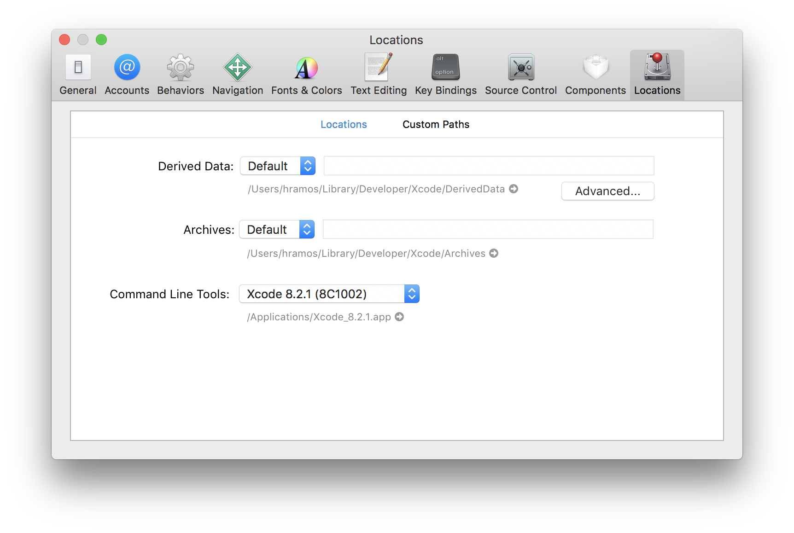

# Auto App

## Description

This project is a monorepo that has built-in `auto-backend` and also includes the `auto-app`".

This Project contains a shared package named `@auto/backend` and the `@subpace/auto-app`

The `auto-app` is built in top of [Expo Go](https://expo.dev/)

## Prerequisites

### Node & Watchman

It is recommended to install Node and Watchman using Homebrew on macOS. Run the following commands in a terminal after installing Homebrew:
```
brew install node
brew install watchman
```
If you have already installed Node on your system, make sure it is Node 18.

[Watchman](https://facebook.github.io/watchman) is a tool by Facebook for watching changes in the filesystem. It is highly recommended to install it for better performance.

### iOS

#### Xcode
The easiest way to install Xcode is via the [Mac App Store](https://itunes.apple.com/us/app/xcode/id497799835?mt=12). Installing Xcode will also install the iOS Simulator and all the necessary tools to build your iOS app.

If you have already installed Xcode on your system, make sure it is version 10 or newer.

#### Command Line Tools
You will also need to install the Xcode Command Line Tools. Open Xcode, then choose Settings... (or Preferences...) from the Xcode menu. Go to the Locations panel and install the tools by selecting the most recent version in the Command Line Tools dropdown.


#### Installing an iOS Simulator in Xcode
To install a simulator, open Xcode > Settings... (or Preferences...) and select the Platforms (or Components) tab. Select a simulator with the corresponding version of iOS you wish to use.

If you are using Xcode version 14.0 or greater than to install a simulator, open Xcode > Settings > Platforms tab, then click "+" icon and select iOS… option.

#### CocoaPods
[CocoaPods](https://cocoapods.org/) is one of the dependency management system available for iOS. CocoaPods is a Ruby gem. You can install CocoaPods using the version of Ruby that ships with the latest version of macOS.

For more information, please visit [CocoaPods Getting Started guide](https://guides.cocoapods.org/using/getting-started.html).

### Android

#### Java Development Kit
We recommend installing the OpenJDK distribution called Azul Zulu using Homebrew. Run the following commands in a Terminal after installing Homebrew:

```
brew tap homebrew/cask-versions
brew install --cask zulu17

# Get path to where cask was installed to double-click installer
brew info --cask zulu17
```

After you install the JDK, update your JAVA_HOME environment variable. If you used above steps, JDK will likely be at `/Library/Java/JavaVirtualMachines/zulu-17.jdk/Contents/Home`

The Zulu OpenJDK distribution offers JDKs for **both Intel and M1 Macs**. This will make sure your builds are faster on M1 Macs compared to using an Intel-based JDK.

If you have already installed JDK on your system, we recommend JDK 17. You may encounter problems using higher JDK versions.

## Using a physical device

> You will have to install Expo Go on your mobile App to run the app 

Google Play for Android users [link](https://play.google.com/store/apps/details?id=host.exp.exponent&hl=fr&gl=US)

App Store for iPhone users [link](https://apps.apple.com/us/app/expo-go/id982107779)

Expo Go is really mandatory if you want to run the app on your mobile.


## Install
> To install `pnpm` I recommand the official website [documentation](https://pnpm.io/installation) 

```sh
pnpm install
```
> As soon you install the dependencies, the `@auto/backend` will be built right away and be ready to use buy the mobile app

### Dev Environment
```sh
# you need to browse to the auto-app folder
cd apps/auto-app
# this one needs to be run once in the first time 
# or everytime you add a dependencies that has some native module that needs to be installed 
# this might take a while at first depending on your network
pnpm expo prebuild:clean 
```
### Dev iOS Environment
> this to run the app on a local environment with a simulator
```sh
pnpm expo run:ios
```
> if you want to run the app on your device you can follow these steps
```sh
pnpm expo start
# then you can type inside the terminal `s` to swithc to Expo Go
# then you can just scan the QR code with your iPhone
# Then you will be redirected to safari and then you will need to choose between a development build or production build
```
### Dev android environment
> this to run the app on a local environment with an emulator
```sh
pnpm expo run:android
```
> if you want to run the app on your device you can follow these steps
```sh
pnpm expo start
# then you can type inside the terminal `s` to swithc to Expo Go
# for android its slightly different you will need to open `Expo Go` app then click on scan QR code
# then you scan the QR code and the app should open in your mobile
```

## Clean Output files
> these commands needs to be run in the root of the project
```sh
pnpm clean
```

## Clean all the output files

```sh
pnpm clean:all
```
